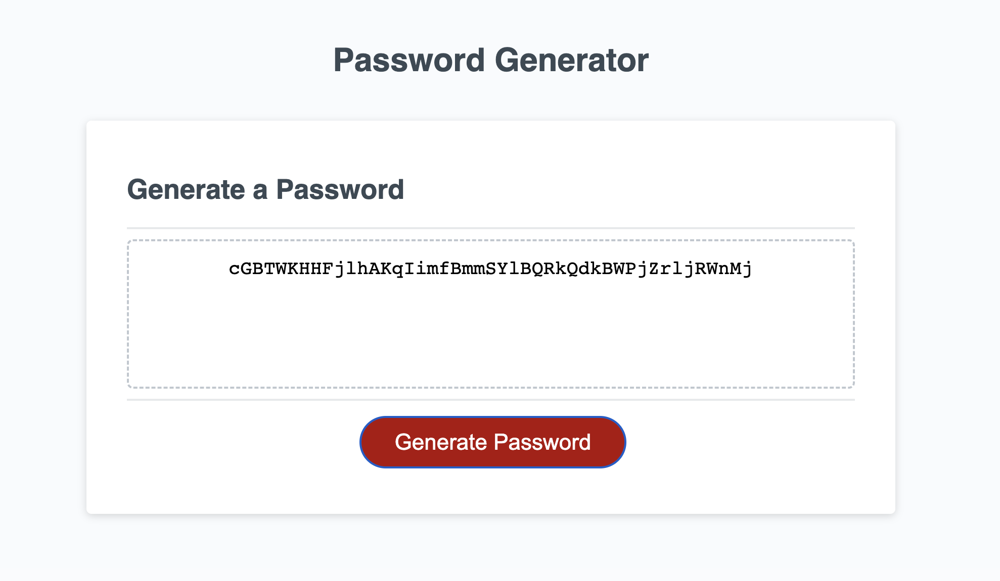

# <Your-Project-Title>

## Description

The project this week was to create a random password generator using javascript!
When a user visits the webpage, they are able to click a button to generate a password compiled of different character types and length.
The user is able to choose which character types to include and exclude, and create a custom length for their password!
It utilizes many of the basic javascript tools like arrays, variables, functions, if statements, and for loops - which makes it a great
assignment! 

No installation necessary, simply deploy the webpage via the github pages link!

Provide instructions and examples for use. Include screenshots as needed.

To add a screenshot, create an `assets/images` folder in your repository and upload your screenshot to it. Then, using the relative file path, add it to your README using the following syntax:

Created by Brandon Wing!
https://github.com/rudyxwhite/

## License

NO LICENSE NEEDED for this!

---

The deployed app features a button that when clicked sets off a series of prompts.
First prompt asks for password length, and the remaining prompts ask whether or not to include uppercase, lowercase, numeric, or special characters.

Depending on the user input, a random string of text is generated and displayed within the textbox on the page.

When refreshed, the user can create a new password by clicking the button again.

